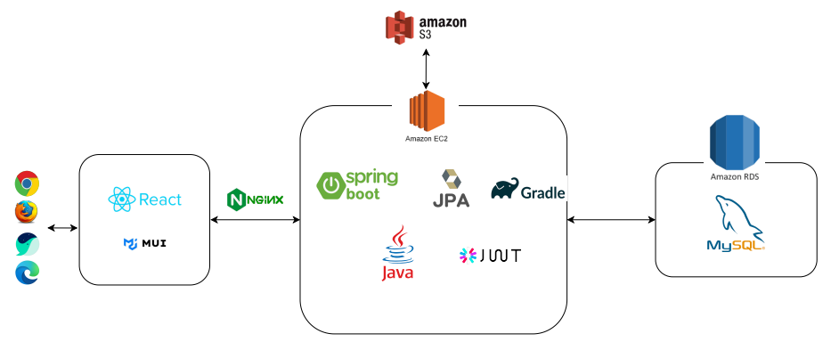
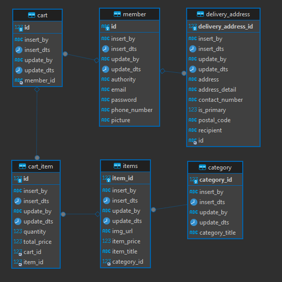

# 차량 용품 판매 사이트

## 개발환경

- IntelliJ
- Postman
- GitHub
- Mysql Workbench
- Visual Studio Code

## 사용 기술

### 백엔드

**주요 프레임워크 / 라이브러리**

- Java 11 openjdk
- SpringBoot 2.7.7
- SpringBoot Security
- Spring Data JPA

**Build tool**

- Gradle

**DataBase**

- MySql

**Infra**

- AWS EC2
- AWS S3
- AWS RDS

### 프론트엔드

- React
- MUI
- Redux

### 기타 주요 라이브러리

- Lombok

## 핵심 키워드

- 스프링 부트, 스프링 시큐리티를 사용하여 웹 애플리케이션 생애 주기 기획부터 배포 유지 보수까지 전과정 개발
- JPA, Hibernate를 사용한 도메인 설계
- MVC 프레임워크 기반 백엔드 서버 구축
- 계층형 아키텍처

## 시스템 아키텍처

## ERD

## 주요 기능

### 소셜 로그인

소셜 로그인 구현을 위해 Spring Security와 OAuth2 인증 방식을 사용했으며,

소셜 인증 제공자 추가로 인한 확장을 대비하여 엑세스 토큰으로 받아오는 유저 정보를 OAuth2UserInfo 인터페이스로 추상화 하여 파싱하도록 설계했습니다.

[[Oauth2UserInfo인터페이스]](https://github.com/KimYongJ/Practice_Back/blob/master/practice_back/src/main/java/com/practice_back/entity/Oauth2/Oauth2UserInfo.java)

또한 확장성 있는 객체 생성을 위해, 객체 생성을 담당하는 클래스는 익명 인터페이스를 사용한 팩토리 메서드 패턴으로 구현하였습니다 .

[[UserInfoFactory 클래스]](https://github.com/KimYongJ/Practice_Back/blob/master/practice_back/src/main/java/com/practice_back/factory/FactoryUserInfo.java)

##

### 비밀번호 찾기

JavaMailSender를 활용하여, 임시 비밀번호 발급 및 이메일 전송 기능을 구현했습니다.

[[JavaMailSender]](https://github.com/KimYongJ/Practice_Back/blob/master/practice_back/src/main/java/com/practice_back/service/impl/EmailAuthServiceImpl.java)

##

### 마스터 계정과 일반 사용자 계정 분리

Spring Security를 사용하여, 관리자와 일반 사용자의 권한을 구분하고 이에 따른 API 접근 제어를 설정했습니다. 이를 위해 filterChain을 커스터마이즈하여, 사용자 유형에 따라 접근 권한을 다르게 처리하도록 구현하였습니다.

- WebSecurityConfig에서 filterChain을 설정하여, Role-based Authorization을 구현했습니다.
- 관리자는 전체 API에 접근할 수 있도록 설정하고, 일반 사용자는 일부 제한된 API만 접근할 수 있도록 구성했습니다.

자세한 구현 내용은 아래 링크에서 확인하실 수 있습니다.

[[SecurityFilterChain]](https://github.com/KimYongJ/Practice_Back/blob/master/practice_back/src/main/java/com/practice_back/config/WebSecurityConfig.java)

##

### S3에 이미지 업로드

##

### 카트 추가

